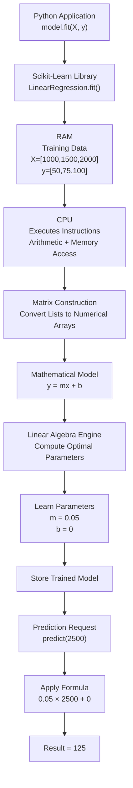

# How Linear Regression Works Internally

## Overview

When we execute the following Python code:

```python
from sklearn.linear_model import LinearRegression

model = LinearRegression()
model.fit(X, y)
```

it may appear that the model is learning magically. In reality, the machine learning library performs a series of mathematical and computational steps to discover a relationship in the data.

This document explains what happens internally, from Python code to CPU execution and prediction generation.

---

## Example Dataset

| House Size (sq ft) | Price |
|-------------------|--------|
| 1000 | 50 |
| 1500 | 75 |
| 2000 | 100 |

The goal is to learn a relationship between house size and price.

---

## High-Level Architecture



---

## Step 1: Python Calls the Library

The application code:

```python
model.fit(X, y)
```

does not perform the learning itself.

Instead, Python delegates the task to Scikit-Learn:

```text
Python
    ↓
Scikit-Learn
    ↓
LinearRegression.fit()
```

The library contains the implementation of the machine learning algorithm.

---

## Step 2: Data Is Loaded into Memory (RAM)

The training data is stored in memory:

```text
X = [1000, 1500, 2000]
y = [50, 75, 100]
```

Conceptually:

```text
RAM
 ├── X values
 └── y values
```

The CPU reads these values repeatedly during training.

---

## Step 3: Matrix Construction

Machine learning libraries operate on matrices rather than ordinary Python lists.

The data is converted into numerical arrays:

```text
X =
[[1000]
 [1500]
 [2000]]

y =
[[50]
 [75]
 [100]]
```

This representation enables efficient mathematical operations.

---

## Step 4: Define the Mathematical Model

Linear Regression assumes a linear relationship:

```text
y = mx + b
```

Where:

- `y` = predicted value
- `x` = input value
- `m` = slope
- `b` = intercept

Initially, the values of `m` and `b` are unknown.

The purpose of training is to determine the best values.

---

## Step 5: CPU Executes Mathematical Operations

The CPU performs operations such as:

```text
Read Memory
Multiply Numbers
Add Numbers
Store Results
Repeat
```

Although we call a single Python function, thousands of low-level instructions may be executed internally.

---

## Step 6: Linear Algebra Finds the Best Fit

The library computes the optimal coefficients using linear algebra.

Conceptually:

```text
Input Data
      ↓
Measure Error
      ↓
Compute Best Line
      ↓
Return Parameters
```

For Ordinary Least Squares (OLS), the mathematical solution is:

```text
β = (XᵀX)⁻¹Xᵀy
```

The result is:

```text
m = 0.05
b = 0
```

The learned equation becomes:

```text
Price = 0.05 × Size
```

---

## Step 7: Store the Trained Model

After training, the model stores only the learned parameters:

```python
model.coef_      = 0.05
model.intercept_ = 0
```

Many beginners assume the model stores all training records.

For simple linear regression, the important output is usually just the learned coefficients.

---

## Step 8: Prediction

Suppose a new house size arrives:

```python
model.predict([[2500]])
```

The model retrieves:

```text
m = 0.05
b = 0
```

and computes:

```text
y = mx + b

y = 0.05 × 2500 + 0

y = 125
```

Result:

```text
125
```

---

## Visualizing the Training Data

The training data can be visualized as:

```text
Price
 ^
 |
100 |                          ●
    |
 75 |              ●
    |
 50 |    ●
    |
    +---------------------------------> House Size
       1000      1500       2000
```

The objective of Linear Regression is to find the best straight line passing through these points.

---

## What Is Actually Happening?

The complete workflow can be summarized as:

```text
Data
  ↓
Store in RAM
  ↓
CPU Executes Instructions
  ↓
Matrix Operations
  ↓
Linear Algebra
  ↓
Learn Parameters
  ↓
Store Model
  ↓
Generate Predictions
```

---

## Key Takeaway

A machine learning model is not magic.

When we call:

```python
model.fit(X, y)
```

the library:

1. Reads the data from memory.
2. Converts it into matrices.
3. Applies mathematical formulas.
4. Uses the CPU to perform calculations.
5. Learns model parameters.
6. Stores those parameters.
7. Uses them later to generate predictions.

For Linear Regression, the final trained model may consist of only a few numbers:

```text
m = 0.05
b = 0
```

Yet those numbers capture the pattern present in the training data and allow future predictions.
